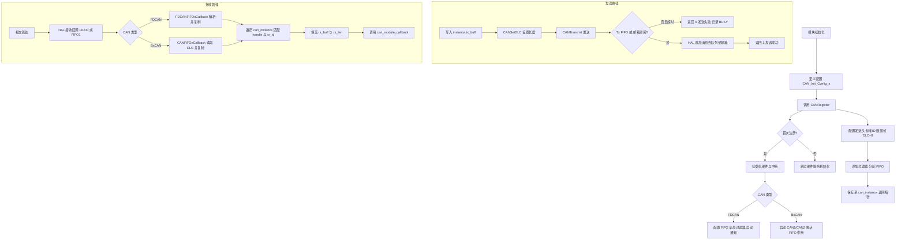
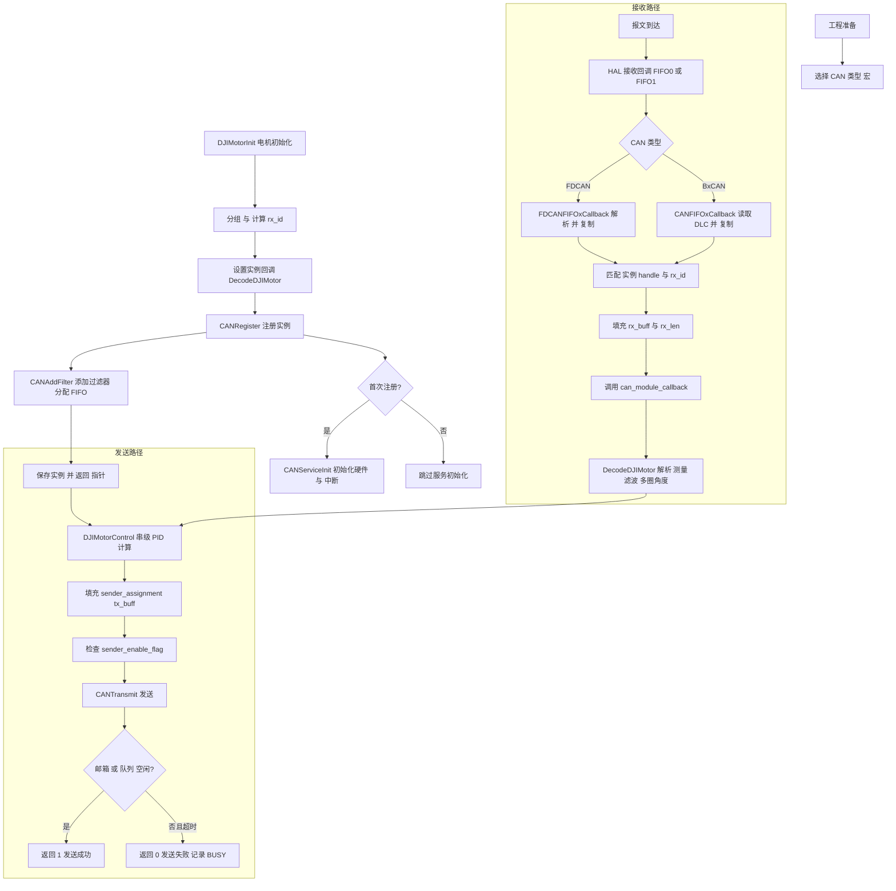

# bsp_can

<p align='right'>neozng1@hnu.edu.cn</p>

# 请注意使用CAN设备的时候务必保证总线只接入了2个终端电阻！开发板一般都有一个，6020电机、c620/c610电调、LK电机也都有终端电阻，注意把多于2个的全部断开（通过拨码）

## 使用说明

若你希望新增一个基于CAN的module，首先在该模块下应该有一个包含`can_instance`指针的module结构体（或当功能简单的时候，可以是单独存在的
`can_instance`，但不推荐这样做）。

## 代码结构

.h文件内包括了外部接口和类型定义,以及模块对应的宏。c文件内为私有函数和外部接口的定义。

## 类型定义

```c

#define MX_REGISTER_DEVICE_CNT 12  // maximum number of device can be registered to CAN service, this number depends on the load of CAN bus.
#define MX_CAN_FILTER_CNT (4 * 14) // temporarily useless
#define DEVICE_CAN_CNT 2           // CAN1,CAN2

/* can instance typedef, every module registered to CAN should have this variable */
typedef struct _
{
    CAN_HandleTypeDef *can_handle; // can句柄
    CAN_TxHeaderTypeDef txconf;    // CAN报文发送配置
    uint32_t tx_id;                // 发送id
    uint32_t tx_mailbox;           // CAN消息填入的邮箱号
    uint8_t tx_buff[8];            // 发送缓存,发送消息长度可以通过CANSetDLC()设定,最大为8
    uint8_t rx_buff[8];            // 接收缓存,最大消息长度为8
    uint32_t rx_id;                // 接收id
    uint8_t rx_len;                // 接收长度,可能为0-8
    // 接收的回调函数,用于解析接收到的数据
    void (*can_module_callback)(struct _ *); // callback needs an instance to tell among registered ones
    void *id;                                // 使用can外设的模块指针(即id指向的模块拥有此can实例,是父子关系)
} CANInstance;

typedef struct 
{
    CAN_HandleTypeDef* can_handle;
    uint32_t tx_id;
    uint32_t rx_id;
    void (*can_module_callback)(can_instance*);
    void* id;
} can_instance_config;

typedef void (*can_callback)(can_instance*);
```

- `MX_REGISTER_DEVICE_CNT`是最大的CAN设备注册数量，当每个设备的发送频率都较高时，设备过多会产生总线拥塞从而出现丢包和数据错误的情况。
- `MX_CAN_FILTER_CNT`是最大的CAN接收过滤器数量，两个CAN共享标号0~
  27共28个过滤器。这部分内容比较繁杂，暂时不用理解，有兴趣自行参考MCU的数据手册。当前为简单起见，每个过滤器只设置一组规则用于控制一个id的过滤。
- `DEVICE_CAN_CNT`是MCU拥有的CAN硬件数量。

- `can_instance`
  是一个CAN实例。注意，CAN作为一个总线设备，一条总线上可以挂载多个设备，因此多个设备可以共享同一个CAN硬件。其成员变量包括发送id，发送邮箱（不需要管，只是一个32位变量，CAN收发器会自动设置其值），发送buff以及接收buff，还有接收id和接收协议解析回调函数。
  **由于目前使用的设备每个数据帧的长度都是8，因此收发buff长度暂时固定为8**。定义该结构体的时候使用了一个技巧，使得在结构体内部可以用结构体自身的指针作为成员，即
  `can_module_callback`的定义。

- `can_instance_config`是用于初始化CAN实例的结构，在调用CAN实例的初始化函数时传入（下面介绍函数时详细介绍）。

- `can_module_callback()`是模块提供给CAN接收中断回调函数使用的协议解析函数指针。对于每个需要CAN的模块，需要定义一个这样的函数用于解包数据。
- 每个使用CAN外设的module，都需要在其内部定义一个`can_instance*`。

## 外部接口

```c
void CANRegister(can_instance* instance, can_instance_config config);
void CANSetDLC(CANInstance *_instance, uint8_t length); // 设置发送帧的数据长度
uint8_t CANTransmit(can_instance* _instance, uint8_t timeout);
```

`CANRegister`是用于初始化CAN实例的接口，module层的模块对象（也应当为一个结构体）内要包含一个`usart_instance`
。调用时传入实例指针，以及用于初始化的config。`CANRegister`应当在module的初始化函数内被调用，推荐config采用以下的方式定义，更加直观明了：

```c
can_instance_config config={.can_handle=&hcan1,
							.tx_id=0x005,
							.rx_id=0x200,
							can_module_callback=MotorCallback}
```

`CANTransmit()`是通过模块通过其拥有的CAN实例发送数据的接口，调用时传入对应的instance。在发送之前，应当给instance内的
`send_buff`赋值。

## 私有函数和变量

在.c文件内设为static的函数和变量

```c
static can_instance *instance[MX_REGISTER_DEVICE_CNT]={NULL};
```

这是bsp层管理所有CAN实例的入口。

```c
static void CANServiceInit()
static void CANAddFilter(can_instance *_instance)
static void CANFIFOxCallback(CAN_HandleTypeDef *_hcan, uint32_t fifox)
void HAL_CAN_RxFifo0MsgPendingCallback(CAN_HandleTypeDef *hcan)
void HAL_CAN_RxFifo1MsgPendingCallback(CAN_HandleTypeDef *hcan)
```

- `CANServiceInit()`会被`CANRegister()`调用，对CAN外设进行硬件初始化并开启接收中断和消息提醒。

- `CANAddFilter()`在每次使用`CANRegister()`的时候被调用，用于给当前注册的实例添加过滤器规则并设定处理对应`rx_id`
  的接收FIFO。过滤器的作用是减小CAN收发器的压力，只接收符合过滤器规则的报文（否则不会产生接收中断）。

- `HAL_CAN_RxFifo0MsgPendingCallback()`和`HAL_CAN_RxFifo1MsgPendingCallback()`都是对HAL的CAN回调函数的重定义（原本的callback是
  `__week`修饰的弱定义），当发生FIFO0或FIFO1有新消息到达的时候，对应的callback会被调用。`CANFIFOxCallback()`
  随后被前两者调用，并根据接收id和硬件中断来源（哪一个CAN硬件，CAN1还是CAN2）调用对应的instance的回调函数进行协议解析。

- 当有一个模块注册了多个can实例时，通过`CANInstance.id`,使用强制类型转换将其转换成对应模块的实例指针，就可以对不同的模块实例进行回调处理了。

## 注意事项

由于CAN总线自带发送检测，如果总线上没有挂载目标设备（接收id和发送报文相同的设备），那么CAN邮箱会被占满而无法发送。在
`CANTransmit()`中会对CAN邮箱是否已满进行`while(1)`检查。当超出`timeout`之后函数会返回零，说明发送失败。

由于卡在`while(1)`处不断检查邮箱是否空闲，调用`CANTransmit()`
的任务可能无法按时挂起，导致任务定时不精确。建议在没有连接CAN进行调试时，按需注释掉有关CAN发送的代码部分，或设定一个较小的
`timeout`值，防止对其他需要精确定时的任务产生影响。

## 使用流程图



代码参考位置：

- 注册与服务：`BSP/can/bsp_can.c:150`（`CANRegister`），`BSP/can/bsp_can.c:106`（`CANServiceInit`），`BSP/can/bsp_can.c:33`（
  `CANAddFilter`）
- 发送接口：`BSP/can/bsp_can.h:88`（`CANSetDLC`），`BSP/can/bsp_can.c:211`（`CANTransmit`）
- 接收回调：`BSP/can/bsp_can.c:379`（`HAL_CAN_RxFifo0MsgPendingCallback`），`BSP/can/bsp_can.c:389`（
  `HAL_CAN_RxFifo1MsgPendingCallback`），`BSP/can/bsp_can.c:306`（`HAL_FDCAN_RxFifo0Callback`），`BSP/can/bsp_can.c:320`（
  `HAL_FDCAN_RxFifo1Callback`）
- 类型选择：`BSP/can/bsp_can.h:4-13`（`FDCAN`/`BXCAN` 宏）

## 完整 CAN 使用流程（BSP 与电机模块）

- 类型宏选择：在 `BSP/can/bsp_can.h:4-13` 选择 `FDCAN` 或 `BXCAN`。
- 电机初始化：在 `Modules/motor/DJImotor/dji_motor.h:84` 通过 `DJIMotorInit` 初始化。
- 电机分组：`Modules/motor/DJImotor/dji_motor.c:59` 进行分组与接收 `rx_id` 计算。
- 回调绑定：设置 `DecodeDJIMotor` 为实例回调（`dji_motor.c:156`），注册到 CAN（`bsp_can.c:150`）。
- 服务与过滤器：首次注册触发硬件与中断初始化（`bsp_can.c:106`），添加过滤器至 FIFO（`bsp_can.c:33`）。
- 接收处理：HAL 回调分发（`bsp_can.c:306`、`320`、`379`、`389`），匹配实例并复制数据，调用模块回调解析。
- 控制与发送：实时任务进行闭环计算（`dji_motor.c:267`），填充分组发送缓冲，调用 `CANTransmit` 发送（`bsp_can.c:211`）。



## 详细说明

- 类型选择与设备约束
    - 在 `BSP/can/bsp_can.h:4-13` 选择 `BXCAN`（F4/F3 等）或 `FDCAN`（H7/G4 等），两者不可同时启用。
    - `BXCAN` 默认支持 2 路 CAN（`DEVICE_CAN_CNT=2`，`BSP/can/bsp_can.h:33`），`FDCAN` 可至 3 路（`BSP/can/bsp_can.h:25`）。

- CAN 实例注册流程
    - 模块构造 `CAN_Init_Config_s`（`BSP/can/bsp_can.h:61-72`），关键字段：`can_handle`（`hcan1/hcan2` 或 `hfdcanX`），`tx_id`，
      `rx_id`，`can_module_callback`，`id`（指向模块实例）。
    - 调用 `CANRegister` 完成注册（`BSP/can/bsp_can.c:150`）。首次注册触发 `CANServiceInit`（`BSP/can/bsp_can.c:106`
      ），并进行发送头配置（`FDCAN` 路径见 `BSP/can/bsp_can.c:181-189`，`BXCAN` 路径见 `BSP/can/bsp_can.c:191-195`）。
    - 注册时进行重复校验，避免同一 `can_handle + rx_id` 重复（`BSP/can/bsp_can.c:165-175`）。

- 过滤器与 FIFO 分配
    - 通过 `CANAddFilter` 为实例添加接收过滤规则（`BSP/can/bsp_can.c:33`）。
    - `BXCAN`：采用 `IDLIST` 模式，16 位缩放，奇偶分配 FIFO0/FIFO1（`BSP/can/bsp_can.c:82-94`）。
    - `FDCAN`：采用 `DUAL` 过滤类型，按 `rx_id` 指定到 FIFO0 或 FIFO1（`BSP/can/bsp_can.c:68-79`）。

- 接收回调分发
    - BxCAN 路径：HAL 回调 `HAL_CAN_RxFifo0MsgPendingCallback` 与 `HAL_CAN_RxFifo1MsgPendingCallback`（
      `BSP/can/bsp_can.c:379`、`BSP/can/bsp_can.c:389`）调用 `CANFIFOxCallback` 遍历实例、匹配 `can_handle` 与 `rx_id`（
      `BSP/can/bsp_can.c:344-365`）。
    - FDCAN 路径：HAL 回调 `HAL_FDCAN_RxFifo0Callback` 与 `HAL_FDCAN_RxFifo1Callback`（`BSP/can/bsp_can.c:306`、
      `BSP/can/bsp_can.c:320`）调用 `FDCANFIFOxCallback`，解析 `DataLength` 并复制数据（`BSP/can/bsp_can.c:268-303`）。

- 电机反馈解析（模块回调）
    - 电机初始化时绑定 `DecodeDJIMotor` 为实例的 `can_module_callback`（`Modules/motor/DJImotor/dji_motor.c:216-219`）。
    - 在 `DecodeDJIMotor` 中解析 `rx_buff`：编码器值 `ecd` 与 `last_ecd`（`Modules/motor/DJImotor/dji_motor.c:169`）、单圈角度
      `angle_single_round`（`Modules/motor/DJImotor/dji_motor.c:170`）、角速度平滑 `speed_aps`（
      `Modules/motor/DJImotor/dji_motor.c:171-172`）、电流平滑 `real_current`（`Modules/motor/DJImotor/dji_motor.c:173-174`
      ）、温度（`Modules/motor/DJImotor/dji_motor.c:175`）。
    - 多圈角度计算采用跳变阈值 4096 进行圈计数与总角度计算（`Modules/motor/DJImotor/dji_motor.c:177-183`）。

- 电机分组与接收 ID 计算
    - `MotorSenderGrouping` 根据电机类型与拨码/闪动 ID 分配发送分组与 `message_num`，并计算对应 `rx_id`（
      `Modules/motor/DJImotor/dji_motor.c:59-148`）。
    - 典型规则：M2006/M3508 接收 `0x200 + (id)`（`Modules/motor/DJImotor/dji_motor.c:97-101`）；GM6020 接收 `0x204 + (id)`（
      `Modules/motor/DJImotor/dji_motor.c:127-131`）。

- 串级 PID 控制与参考输入
    - 控制在 `DJIMotorControl` 中执行，按 `outer_loop_type` 与 `close_loop_type` 进行串级计算（
      `Modules/motor/DJImotor/dji_motor.c:267-329`）。
    - 位置环、速度环、电流环各自支持前馈与反馈源切换（`Modules/motor/DJImotor/dji_motor.c:291-313`、
      `Modules/motor/DJImotor/dji_motor.c:316-321`）。
    - 反转标志与反馈反向处理（`Modules/motor/DJImotor/dji_motor.c:286-288`、`Modules/motor/DJImotor/dji_motor.c:323-325`）。

- 分组发送与空组保护
    - 将最终设定值填入分组 `sender_assignment[group].tx_buff` 指定位置（`Modules/motor/DJImotor/dji_motor.c:330-334`）。
    - 若电机处于停止状态，置零对应报文片段（`Modules/motor/DJImotor/dji_motor.c:336-338`）。
    - 遍历分组使能标志并发送（`Modules/motor/DJImotor/dji_motor.c:342-351`）。

- 发送接口与超时策略
    - `CANTransmit` 等待邮箱/队列空闲，超时返回失败并记录 busy 次数（`BSP/can/bsp_can.c:211-243`）。
    - FDCAN 使用 `HAL_FDCAN_AddMessageToTxFifoQ`（`BSP/can/bsp_can.c:232`），BxCAN 使用 `HAL_CAN_AddTxMessage`（
      `BSP/can/bsp_can.c:235`）。
    - 数据长度设置建议：BxCAN 直接填 `DLC=长度`（`BSP/can/bsp_can.c:195`）；FDCAN 推荐将字节长度映射到 `FDCAN_DLC_BYTES_n`
      ，当前实现直接写 `DataLength=length`（`BSP/can/bsp_can.c:254`），后续可优化为枚举映射。

- 使用建议与常见问题
    - 当总线上无对应接收设备时，邮箱可能长期占满导致任务周期被拉长；建议调试时降低超时或临时屏蔽发送路径（
      `BSP/can/bsp_can.md:112-114`）。
    - FDCAN `DataLength` 建议使用枚举映射，避免新版本 HAL 不兼容带来的长度解析异常（参考 `BSP/can/bsp_can.c:276-283`
      的长度解码）。
    - 电机数量与频率：单总线电机过多时应降低反馈频率，避免拥塞与仲裁失败（参考
      `Modules/motor/DJImotor/dji_motor.md:12-13`）。